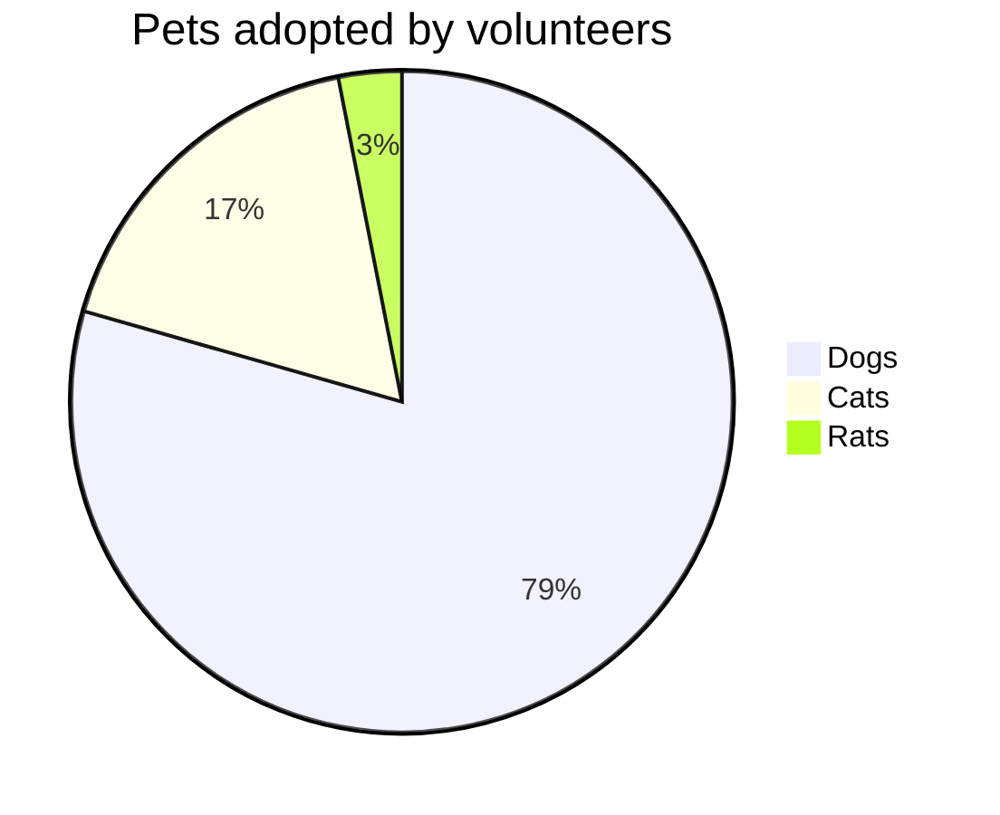

# Beispiel-MD-Datei

## Überschrift

Das ist eine Beispielüberschrift.

## Fettdruck

**Dieser Text ist fett gedruckt.**

## Tabelle

| Spalte 1 | Spalte 2 | Spalte 3 |
|----------|----------|----------|
| Inhalt A | Inhalt B | Inhalt C |
| Inhalt D | Inhalt E | Inhalt F |

## Kursiv

*Dieser Text ist kursiv.*

## Geordnete Liste

1. erstens

2. zweitens

3. drittens

Here is a simple flow chart:

##Unterstrichener Text

++unterstrichen++

## Bild

